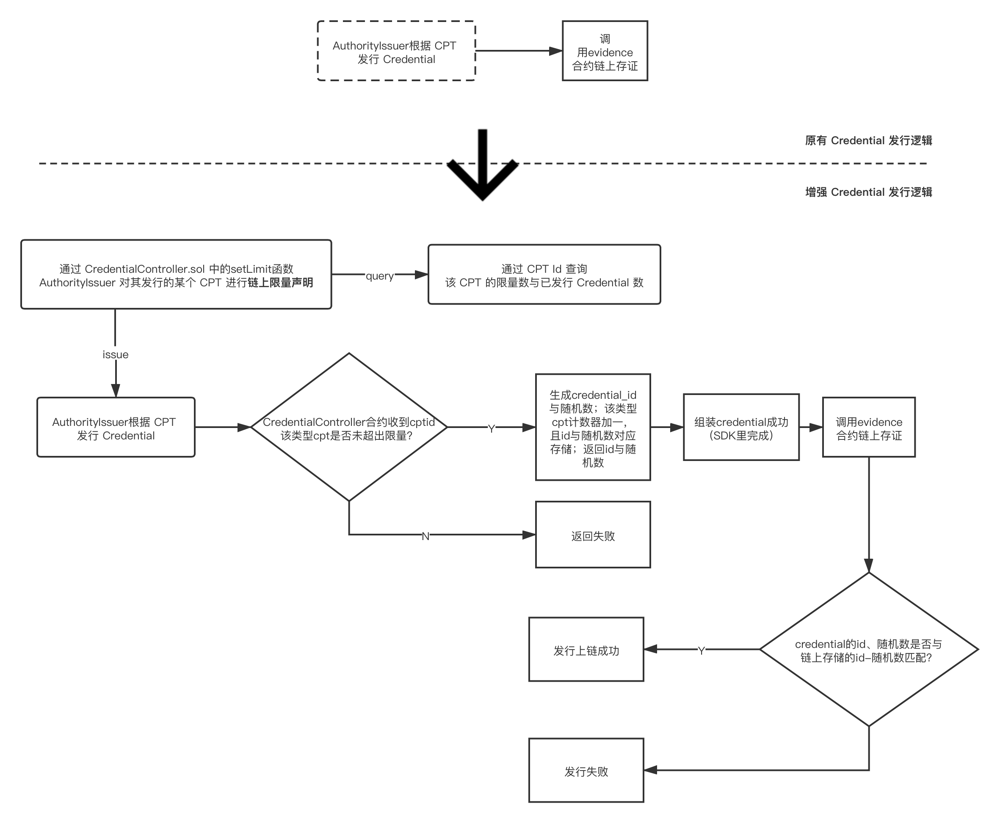

# WeIdentity 的多签及限量 CPT 的实现

**本文档描述的合约均适用于：**

**FISCO BCOS / CITA。**

[TOC]

## 0. 项目特性

- **智能合约创意新颖、设计巧妙和通用性强**

  WeIdentity 方案基于 Solidity 编写，适用于许多需要数字身份的场景，如教育、金融等。

  本项目写的多签方案与 CredentialController 同理。

  **其中，CredentialController 为独立模块，因此不仅适用于 WeIdentity 方案，也适用于其它基于 Solidity 的 DID 方案。**

- **智能合约函数、事件、结构等设计规范性、合理性、执行效率与安全性**

  本项目遵循 Solidity 开发规范，且每一个新增函数均包含测试，符合 TDD 原则。

- **代码编写简洁规范、可读性强，注释清晰准确**

  保证每一个函数均有标准注释，且变量命名清晰规范，具有高可读性。

- **设计说明文档规范、结构完整、内容详细准确**

  设计文档完整，包括其实现功能、结构设计、流程设计、使用演示与未来规划。

- **多底层框架版本**

  不仅适用于 FISCO BCOS，还适用于 CITA 等使用 EVM 的联盟链。

## 1. WeIdentity 介绍

WeIdentity是一套分布式多中心的技术解决方案，可承载实体对象（人或者物）的现实身份与链上身份的可信映射、以及实现实体对象之间安全的访问授权与数据交换。WeIdentity由微众银行自主研发并完全开源，秉承公众联盟链整合资源、交换价值、服务公众的理念，致力于成为链接多个垂直行业领域的分布式商业基础设施，促进泛行业、跨机构、跨地域间的身份认证和数据合作。

目前主要包括两大模块：**WeIdentity DID 以及 WeIdentity Credential，**一个是去中心化身份，另一个是链上凭证。

WeIdentity 使用 Solidity 进行合约开发，主要包括以下两个部分：

- **WeIdentity DID智能合约**，负责链上 ID 体系建立，具体包括生成 DID（Distributed IDentity）、生成 DID Document、DID 在链上的读取与更新。
- **WeIdentity Authority智能合约**，负责进行联盟链权限管理，具体包括链上 DID 角色的定义、操作与权限的定义与控制。

## 2. WeIdentity 升级点

要讲 WeIdentity 合约使用于正式生产环境，还有一些地方需要升级。

- **权限控制方向**

目前 WeIdentity 合约的权限控制方案：


在实际生产环境中，**我们需要包括多签功能的更精准的权限控制。**

在进行修改后，权限控制方案如下：

|          操作           | 一般DID | Authority Issuer | Commitee Member | Administrator |
| :---------------------: | :-----: | :--------------: | :-------------: | :-----------: |
|  增删改 Adminnistrator  |    N    |        N         |        N        |       Y       |
| 增删改 Committee Member |    N    |        N         |        N        |       Y       |
| 增删改 Authority Issuer |    N    |        N         |   Y（可多签）   | Y |
|      发行授权 CPT       |    N    |       Y       |       Y       |       Y       |

我们通过对 `AuthorityIssuer.sol` 合约模块的升级，来实现多签的功能。

- **限量发行方向**

在当前的流程中，我们会通过合约定义 CPT（Claim Protocol Type，凭证的声明类型），然后根据自定义的 CPT 模板发布 Credential（可验证的数字凭证）。

Crendential 和 ERC721 有类似之处，因此我们可以对发行 Credential 的流程进行升级，并加入新的合约，使其支持某一类型的 CPT 「限量发行」。例如某合格证书只发行一千个。

## 3. WeIdentity 合约结构与升级部分示意图


## 4. 权限控制（多签）的简介、接口描述与使用示范

`AuthorityIssuerController`合约主要功能是对于 AuthorityIsser 角色的增加、删除、修改与查询，本次升级在增加中加入多签功能。

#### 4.1 合约接口描述

- **addAuthorityIssuer**
  **功能**：新增 AuthorityIssuer

  **类型**：原函数修改

  **参数：**

  |    变量名     |    类型     |           含义            |
  | :-----------: | :---------: | :-----------------------: |
  |     addr      |   Address   | 新增authorityIssuer的地址 |
  | attribBytes32 | bytes32[16] |           名字            |
  |   attribInt   |   int[16]   |         创建日期          |
  |   accValue    |    bytes    |   值（预留，目前无用）    |
  **返回值：** 无

- **signTransaction**
  **功能**：实现多签功能

  **类型**：新增函数

  **参数**：

  |    变量名     | 类型 |         含义          |
  | :-----------: | :--: | :-------------------: |
  | transactionId | uint | 需要进行多签的交易 id |
  
  **返回值**：无

- **getTxIDNeedMultiSigNum**
  **功能**：查询某交易还需要的签名数

  **类型**：新增函数

  **参数：**

  |    变量名     | 类型 |        含义        |
  | :-----------: | :--: | :----------------: |
  | transactionId | uint | 需要查询的交易id |
  
  **返回值**：

  |    变量名     | 类型 |        含义        |
  | :-----------: | :--: | :----------------: |
  | TxIDNeedMultiSigNum | uint | 查询的交易还需要的多签数量 |

- **getPendingTransactions**
  **功能**：获取当前所有需要被多签的交易

  **类型**：新增函数

  **参数**：无

  **返回值**：

  |    变量名     | 类型 |        含义        |
  | :-----------: | :--: | :----------------: |
  | PendingTransactions | uint[] | 当前所有需要被多签的交易 |
  
- **setTxIdMultiSig**
  **功能**：设置某交易的多签数量

  **类型**：新增函数

  **说明**：因为该函数决定了新增 Authority Issuer 所需要的 Committee Member 数量，因此调用该函数需要 Administrator 权限【[见2](# 2 WeIdentity 升级点) 】。

  **参数：**

  |    变量名     | 类型 |       含义       |
  | :-----------: | :--: | :--------------: |
  | transactionId | uint | 需要设置的交易id |
  |   minNumber   | uint |  要求的多签数量  |

  **返回值**：无

#### 4.2 合约使用示范

1. **使用账户1部署合约**


2. **部署成功**


3. **测试新增 authorityIssuer 函数**


其中，address 是新增为 authorityIssuer 的账户地址，attribBytes32 是名字，attribInt 是创建的日期.

4. **填写参数，进行测试**

transact后，该交易会被放入等待交易队列中，结果返回的交易序号为3。


5. **测试查询等待队列函数**

由于上述交易逻辑上会被保存进等待队列，因此这里我们去查看一下等待队列中是否真正被放入了该交易：


查询结果与逻辑无误。

6. **设置多签要求**


在多签之前，我们需要先为该等待交易设置多签数量，若不设置，则无法进行多签，这里我们为上述等待交易设置多签限制为2。


7. **测试多签函数**

设置完成后，我们使用当前账户（具备权限）对上述交易序号为3的交易进行多签：


结果返回签名成功，我们再切换其他具有权限的账户进行签名，这里是否具有权限是通过这段代码进行判断。

```
if(!roleController.checkPermission(tx.origin,roleController.MODIFY_AUTHORITY_ISSUER())) {
return;
}
```


使用第二个有权限的账户签名成功，由于已满足多签要求，因此新增成功：


## 5. 限量 CPT 的简介、接口描述与使用示范

1）`CredentialController` 为全新合约，主要功能为：

- 声明某 Id 的 Cpt 的 Credential 的发行数量，并存储。
- 发行 Credential 时生成需要的 ID 号与随机数，并存储。
- 提供如下查询：
  - 通过 CPT Id 查询某 CPT 类型的总数及已发行数量。
  - 通过 Credential Id 查询某 Credential 的相应随机数。

2）`EvidenceContract`为旧合约的升级，主要功能是凭证上链，目前对 createEvidence 函数进行增强，加入 creid 与 randNum 两个参数，以实现链上验证的目的。

流程从链下发行 Credential，然后再通过 evidence 进行链上存证，转变为更复杂的**「链上限量声明 → 带验证的发行 → Credential 的合法性与限量 CPT 的总量 / 已发行量可链上查询」**逻辑，以实现某一类型的 CPT 限量发行。



#### 5.1 合约接口描述

- **generateIdAndRandNum**
  **功能**：生成 credentialID 号与随机数

  **类型**：新增函数

  **参数：**

  | 变量名 | 类型 |        含义         |
  | :----: | :--: | :-----------------: |
  | cptid  | uint | 要使用的 cpt 的编号 |

  **返回值**：

  |  变量名  | 类型 |        含义         |
  | :------: | :--: | :-----------------: |
  |  creid   | uint | 生成的 credential 编号 |
  | randNum | uint |   生成的随机数   |

- **setLimit**
  **功能**：设置某类型cpt的可发行的限量数额

  **类型**：新增函数

  **参数：**

  |  变量名  | 类型 |        含义         |
  | :------: | :--: | :-----------------: |
  |  cptid   | uint | 要使用的 cpt 的编号 |
  | limitNum | uint |        该类型cpt限量发行的额数        |

  **返回值**：无

- **getCptLimitAndIssuedNum**
  **功能**：获取某类型 cpt 的可发行的限量数额与已发行 credential 的数量

  **类型**：新增函数

  **参数：**

  |  变量名  | 类型 |        含义         |
  | :------: | :--: | :-----------------: |
  |  cptid   | uint | 要查询的 cpt 的编号 |
  
  **返回值**：

  |  变量名  | 类型 |        含义         |
  | :------: | :--: | :-----------------: |
  |  limitNumber   | uint | 查询的 cpt 类型的可发行限量数额 |
  |  issuedNumber  | uint |  查询的 cpt 类型的已发行 credential 的数量  |

- **getRandNumOfCreid**
  **功能**：获得某 credential 中的的随机数

  **类型**：新增函数

  **参数：**

  | 变量名 | 类型 |           含义           |
  | :----: | :--: | :----------------------: |
  | creid  | uint | 要查询的 credential 编号 |

  **返回值**：

  | 变量名 | 类型 |        含义         |
  | :----: | :--: | :-----------------: |
  | randNum | uint | 查询的credential的随机数 |


- **createEvidence**
  **功能**：存证上链

  **类型**：原函数修改

  **参数：** 

  | 变量名  |  类型   |            含义             |
  | :-----: | :-----: | :-------------------------: |
  |  hash   | string  |           查询存证的key            |
  |   sig   | string  |            发布存证的人的签名            |
  |  extra  | string  |             任意额外数据                |
  | updated | uint256 |           当前event的更新时间                  |
  |  creid  |  uint   | 某类型的cpt编号（新增变量） |
  | randNum |  uint   |     随机数（新增变量）      |

  **返回值**：

  | 变量名 | 类型 |        含义         |
  | :----: | :--: | :-----------------: |
  |  result | uint | 上链成功与否的反馈值 |

#### 5.2 合约使用示范

1. **部署CredentialController合约**


2. **为某类型cpt设置限量数额**

CPT 限量数额默认为零，也就是说如果 CPT 遵循限量发行流程（自然也可以选择传统流程），该 CPT 无法「发行」Credential，必须在设置后，方可发行。


设置成功


3. **查看某类型cpt限额**

这里我们查询刚刚设置的cptid为1的类型的限额


结果为我们刚刚设置的限额1，以及当前已发行的credential数量为0


4. **生成 Credential Id与随机数**

填写cptid，基于该类型生成一对 credential Id 与随机数


生成成功，得到 credential Id 与随机数，该id与随机数一一匹配，用于后续 Evidence 上链时的合法检验。


5. **部署 EvidenceContract 合约**

将此前部署的CredentialController合约地址填入，进行部署


6. **存证上链**

其中creid为要上链的credential的id号，randNum 为此前发行 credential 时得到的与id号一一配对的随机数。


填写参数，randNum处先随意填一个randNum，由于不配对，因此结果返回为0，上链失败。


再填写配对的随机数，进行测试，结果返回为1，上链成功。


## 6. 总结与未来计划

- **对 Credential 限量功能进行进一步的完善**

  目前限量 Credential 的逻辑是 AuthorityIssuer 在发行 CPT 时进行限量声明。如果进一步，我们可以做到多个 Issuer 协商 Credential 总量，之后每个特定的 Issuer 有特定的份额。

- **对 Credential 功能进行进一步的增强**

  例如 Credential 间的联动。

- **更全面更细化的权限控制**

  - 可以在更多方面引入多签。
  - 引入更细化的权限控制，以应对实际生产环境中的复杂场景。

